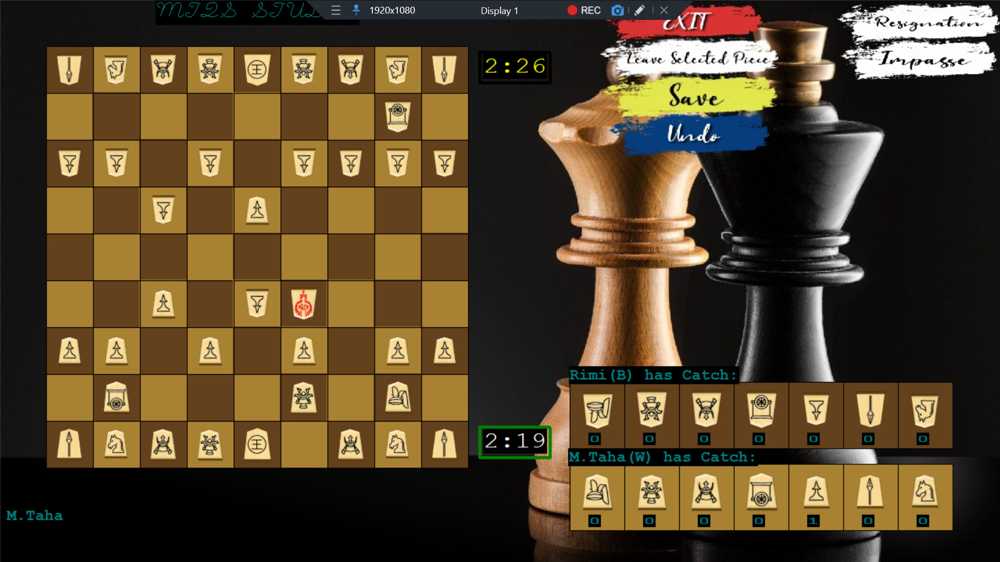

# Shogi-Japanese-chess-Cpp-BGI-2010

We have a user-friendly 2P SHOGI game here, purely made in C++ from scratch, using BGI2010 for GUI. Shogi isn't chess; it's much more than that. You can refer to [this link](https://en.wikipedia.org/wiki/Shogi) for more information.

## Features Included

- Game Menu
- Theme Selection Menu (Game has 3 themes: SHOGI, English, Classical)
- Time Based (users can choose yes/no, counts time for each user's turn and decides a winner based on score as done in Shogi)
- Undo turn
- Cursor / Touch based
- Manual and Auto save
- New Game, Resume Game, Load game state from a saved file
- Moves
- Legality checks
- Promotion (when you enter opponent's territory, you have an option to make yourself more powerful)
- Capturing
- Drops
- Check
- Checkmate
- Castling
- Impasse
- Highlight (Different highlight colors for different players, red in case of capturing. Highlight also defined for dropping captured piece from the captured window into the game board - required extra checks)
- Resignation
- Leave selected piece

## Project Hierarchy

## Themes

## Game Play

## Pieces in Shogi

After promotion:

